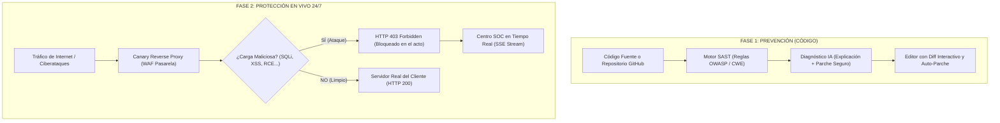

# 🛡️ CANARY — Manual y Explicación Completa del Sistema

Bienvenido a la documentación oficial de **CANARY**, una plataforma integral de ciberseguridad defensiva que combina **Auditoría de Código Fuente asistida por Inteligencia Artificial (SAST)** con un **Escudo de Protección Perimetral 24/7 (WAF Reverse Proxy & RASP)** en tiempo real.

Este documento detalla **qué hace el sistema, cómo funciona internamente y cómo utilizar cada una de sus funciones**.

---

## 📑 Tabla de Contenidos
1. [¿Qué es CANARY y por qué existe?](#1-qué-es-canary-y-por-qué-existe)
2. [Arquitectura General](#2-arquitectura-general)
3. [Módulo 1: Auditor SAST & Auto-Parchador con IA](#3-módulo-1-auditor-sast--auto-parchador-con-ia)
4. [Módulo 2: Inspección de Repositorios Git (GitHub Connect)](#4-módulo-2-inspección-de-repositorios-git-github-connect)
5. [Módulo 3: Guardián 24/7 (WAF Reverse Proxy Activo)](#5-módulo-3-guardián-247-waf-reverse-proxy-activo)
6. [Módulo 4: Simulador de Ciberataques en Vivo](#6-módulo-4-simulador-de-ciberataques-en-vivo)
7. [Módulo 5: Motor de Inteligencia Artificial y Conectores](#7-módulo-5-motor-de-inteligencia-artificial-y-conectores)
8. [Estructura del Proyecto y Archivos](#8-estructura-del-proyecto-y-archivos)
9. [Guía de Uso Rápido](#9-guía-de-uso-rápido)

---

## 1. ¿Qué es CANARY y por qué existe?

El nombre y concepto de **CANARY** se inspira en la histórica labor de los canarios en las minas de carbón: estas pequeñas aves detectaban gases tóxicos invisibles mucho antes de que los mineros pudieran percibirlos, salvándoles la vida.

En el desarrollo web moderno, las empresas y desarrolladores suelen desplegar sitios web y APIs con fallos de seguridad ocultos. **CANARY actúa en dos frentes clave:**

1. **Antes de producción (Fase Preventiva):** Audita el código fuente antes de que los clientes lo usen, detectando vulnerabilidades, explicándolas de forma clara y generando parches seguros para corregirlas con un solo clic.
2. **En producción (Fase Reactiva 24/7):** Conecta y blinda el sitio web o API del cliente mediante un proxy inverso inteligente que intercepta y bloquea ataques en milisegundos sin que el cliente tenga que modificar el código de su servidor.

---

## 2. Arquitectura General



---

## 3. Módulo 1: Auditor SAST & Auto-Parchador con IA

### ¿Qué hace?
Realiza análisis estático de seguridad (*Static Application Security Testing*) sobre código fuente escrito en **JavaScript, TypeScript, PHP, Python, HTML y JSON**. Detecta vulnerabilidades críticas según los estándares internacionales **OWASP Top 10** y la taxonomía **CWE**.

### Vulnerabilidades Principales que Detecta:
* **Inyección SQL (SQLi - CWE-89):** Concatenación de parámetros no saneados en consultas a bases de datos.
* **Cross-Site Scripting (XSS - CWE-79):** Uso inseguro de funciones como `innerHTML`, `document.write` o interpolaciones directas que permiten inyectar scripts maliciosos.
* **Salto de Directorio (Path Traversal / LFI - CWE-22):** Concatenación de rutas de archivos con entradas del usuario (`fs.readFile` sin validación), permitiendo leer archivos sensibles como `/etc/passwd`.
* **Ejecución Remota de Código (RCE - CWE-78 / CWE-94):** Uso de `eval()`, `child_process.exec()` o funciones equivalentes con parámetros directos de la petición.
* **Secretos y Credenciales Expuestas (Hardcoded Secrets - CWE-798):** Detección de contraseñas de bases de datos, claves privadas o tokens API en texto plano dentro del código.

### Funciones Exclusivas de la IA:

#### A. Diagnóstico Didáctico
Al hacer clic en **"Explicar con IA"**, el sistema abre un modal donde desglosa:
1. **Riesgo y Severidad**: Por qué la vulnerabilidad es peligrosa.
2. **Mecanismo del Ataque**: Cómo un ciberdelincuente explotaría esa línea de código.
3. **Solución Recomendada**: La técnica recomendada (consultas preparadas, saneamiento con DOMPurify, etc.).

#### B. Auto-Parchado con Comparador Visual (*Diff*)
Al hacer clic en **"Parche con IA"**, la inteligencia artificial reescribe la sección afectada y muestra un comparador visual:
* **Líneas en Rojo**: Código vulnerable que será eliminado.
* **Líneas en Verde**: Código seguro y refactorizado que se insertará.
* **Botón "Aplicar Parche al Editor"**: Aplica los cambios directamente en el editor con un solo clic.

#### C. Protocolo de Honestidad y Transparencia
Si una vulnerabilidad involucra un secreto expuesto (ej. una contraseña en el código), **la IA no inventa contraseñas falsas ni adivina credenciales**. En su lugar, activa el *Protocolo de Honestidad*: le explica al usuario que los secretos jamás deben subirse al repositorio, le enseña a usar variables de entorno (`.env` / `process.env`) y le muestra un ejemplo de configuración seguro.

---

## 4. Módulo 2: Inspección de Repositorios Git (GitHub Connect)

### ¿Qué hace?
Permite conectar cualquier repositorio de GitHub (público o privado) para auditar la seguridad de un proyecto completo sin necesidad de clonarlo ni descargar archivos manualmente en el ordenador.

### ¿Cómo funciona?
1. **Conexión Ligera**: Utiliza la API pública de GitHub (y opcionalmente un Personal Access Token con permiso `contents:read` si el repositorio es privado).
2. **Explorador de Archivos**: Inspecciona el árbol completo de ramas (*default branch*) y etiqueta automáticamente los archivos auditables de código (`.js`, `.php`, `.py`, etc.).
3. **Carga Inmediata al Editor**: Al pulsar el botón **"Examinar"** junto a cualquier archivo, este se descarga en memoria y se abre al instante en el editor SAST para ejecutar el escaneo.
4. **Auditoría Global de Todo el Proyecto**: El botón **"Auditar Todo el Repositorio"** recorre todos los archivos de código en paralelo, calcula el índice de salud global del proyecto (de 0 a 100) y genera un reporte ejecutivo agrupado por nivel de severidad (Crítica, Alta, Media, Baja).

---

## 5. Módulo 3: Guardián 24/7 (WAF Reverse Proxy Activo)

Este módulo convierte a CANARY en un **escudo perimetral en vivo** para sitios web y APIs de clientes.

### ¿Cómo funciona el WAF Reverse Proxy?

```
[ Usuario o Atacante ]
          │
          ▼
┌────────────────────────────────────────────────────────┐
│  PASARELA BLINDADA CANARY (http://localhost:3000)      │
│  Ruta: /shield/:siteId/*                               │
│                                                        │
│  1. Decodifica la URI para evitar evasión de filtros.  │
│  2. Inspecciona Cabeceras, Parámetros y Cuerpo (JSON). │
│  3. Evalúa contra reglas SQLi, XSS, Traversal, RCE.    │
└────────────────────────────────────────────────────────┘
          │
          ├───────────────────────────────┐
          │ (Si detecta ataque)           │ (Si la petición es limpia)
          ▼                               ▼
┌───────────────────────────┐   ┌───────────────────────────┐
│  BLOQUEO INMEDIATO        │   │  REENVÍO TRANSPARENTE     │
│  HTTP 403 Forbidden       │   │  Al servidor real (8080)  │
│  Registrado en SOC SSE    │   │  Devuelve respuesta 200   │
└───────────────────────────┘   └───────────────────────────┘
```

### Ventajas para el Cliente:
* **Cero Modificaciones:** El cliente **no tiene que alterar ni una sola línea de código** de su servidor. Solo necesita proporcionar su URL de origen.
* **Filtrado en Tiempo Real:** Las peticiones legítimas fluyen con latencia casi nula, mientras que las maliciosas son rechazadas antes de que toquen la base de datos o el sistema operativo del cliente.
* **Servidor Web Demo Integrado:** Se incluye un servidor web real en `src/samples/customer-live-web.js` (puerto 8080) para realizar pruebas reales de tráfico legítimo y hostil.

### Centro SOC (Security Operations Center) en Vivo:
Mediante **Server-Sent Events (SSE)**, la pantalla del Guardián recibe notificaciones en milisegundos cada vez que un ataque es bloqueado, mostrando:
* Fecha y hora exacta.
* IP del atacante.
* Tipo de amenaza interceptada.
* Fragmento de la carga maliciosa neutralizada.
* Estado de respuesta (`403 BLOQUEADO`).

### File Integrity Monitoring (FIM):
Supervisa criptográficamente mediante hashes **SHA-256** los archivos críticos del sistema para detectar en tiempo real si algún archivo ha sido alterado, corrompido o si se ha insertado una *webshell*.

---

## 6. Módulo 4: Simulador de Ciberataques en Vivo

Para validar la capacidad del Guardián sin requerir herramientas externas de penetración, el sistema incluye un laboratorio con 5 botones de ataque controlado:

| Prueba | Vector de Ataque | Carga Simulada | Resultado Esperado |
| :--- | :--- | :--- | :--- |
| **SQLi** | Inyección en consulta de autenticación | `' OR '1'='1'--` | Bloqueado con HTTP 403 |
| **XSS** | Inyección de script para robo de sesión | `<script>document.location=...</script>` | Bloqueado con HTTP 403 |
| **Path Traversal** | Escape de directorio web | `../../../../etc/passwd` | Bloqueado con HTTP 403 |
| **RCE** | Concatenación de comandos de consola | `127.0.0.1; cat /etc/shadow` | Bloqueado con HTTP 403 |
| **Bot Hostil** | Agente de escaneo masivo automatizado | `User-Agent: sqlmap/1.7.2` | Bloqueado con HTTP 403 |

---

## 7. Módulo 5: Motor de Inteligencia Artificial y Conectores

El sistema está diseñado de forma **completamente desacoplada** para funcionar hoy mismo y escalar en el futuro:

1. **Motor Semántico Local (Listo de fábrica):**
   * Funciona de inmediato sin necesidad de conexión a internet ni claves de API.
   * Analiza la estructura del código, detecta el contexto del error y genera explicaciones técnicas completas y parches válidos.
2. **Conectores para APIs Externas de IA:**
   * En la pestaña **"Conectar Mi Web & Ajustes"**, se puede seleccionar el proveedor deseado:
     * **OpenAI:** Modelos `gpt-4o`, `gpt-4o-mini`, etc.
     * **Google Gemini:** Modelos `gemini-1.5-pro`, `gemini-1.5-flash`, etc.
     * **API Personalizada:** Endpoint propio en caso de contar con un servidor local de modelos (como Ollama o vLLM).
   * Cuando el usuario suministre su API Key en el panel, el sistema redirige automáticamente las solicitudes al modelo seleccionado.

---

## 8. Estructura del Proyecto y Archivos

```
canarysss/
├── public/                     # Frontend de la aplicación
│   ├── css/
│   │   └── styles.css          # Sistema de diseño minimalista (Dark Mode + Canary Gold)
│   ├── images/
│   │   └── canary-logo.jpeg    # Logo oficial del canario minero
│   ├── js/
│   │   ├── app.js              # Controlador principal, navegación y toasts
│   │   ├── icons.js            # Librería de iconos vectoriales SVG limpios (sin emojis)
│   │   ├── scanner.js          # Lógica del escáner SAST, llamadas a IA y parches
│   │   ├── repo.js             # Integración con la API de GitHub y explorador de árbol
│   │   ├── guardian.js         # Conexión WAF, streaming SSE de alertas y FIM
│   │   └── settings.js         # Configuración del proveedor de IA y credenciales
│   └── index.html              # Estructura visual con diseño de barra lateral y dashboard
│
├── src/                        # Backend (Node.js + Express)
│   ├── config/
│   │   └── aiConfig.js         # Gestor central de configuración de IA y persistencia
│   ├── controllers/            # Controladores de rutas REST
│   │   ├── sastController.js   # Endpoints de análisis de código y parches
│   │   ├── repoController.js   # Endpoints de GitHub (connect, tree, scan-all)
│   │   ├── guardianController.js # Endpoints de estadísticas y simulación
│   │   ├── siteProxyController.js # Gestión de sitios web vinculados al WAF
│   │   └── settingsController.js  # Endpoints para guardar/leer ajustes de IA
│   ├── routes/                 # Definición de rutas Express
│   ├── services/               # Lógica de negocio central
│   │   ├── sastService.js      # Motor estático con reglas de detección de vulnerabilidades
│   │   ├── aiService.js        # Orquestador de IA (Local, Gemini, OpenAI, Custom)
│   │   ├── guardianService.js  # Motor WAF de inspección y bloqueo en tiempo real
│   │   ├── siteProxyService.js # Reverse proxy pasarela para webs reales de clientes
│   │   ├── githubService.js    # Conexión con GitHub y descarga de archivos
│   │   └── fimService.js       # Monitor de integridad de archivos con SHA-256
│   ├── guardian-agent/
│   │   └── sentinel-agent.js   # Middleware Express alternativo para clientes
│   ├── samples/
│   │   └── customer-live-web.js # Servidor demo del cliente en puerto 8080
│   └── server.js               # Punto de entrada del servidor principal (puerto 3000)
│
├── test/
│   └── test-services.js        # Suite de pruebas unitarias automáticas
├── package.json                # Dependencias y scripts de ejecución
└── DOCUMENTACION_COMPLETA.md   # Este manual explicativo
```

---

## 9. Guía de Uso Rápido

### 1. Iniciar el Servidor Principal
```bash
npm start
```
El panel estará disponible en: **`http://localhost:3000`**

### 2. Iniciar la Web Demo de Pruebas (Opcional)
Para simular un cliente con una tienda web en el puerto 8080:
```bash
node src/samples/customer-live-web.js
```

### 3. Ejecutar las Pruebas Automatizadas
Para verificar que todos los motores de seguridad funcionan correctamente:
```bash
npm test
```

---

> **CANARY** — *Protegiendo el código antes del despliegue, vigilando la web las 24 horas del día.*
